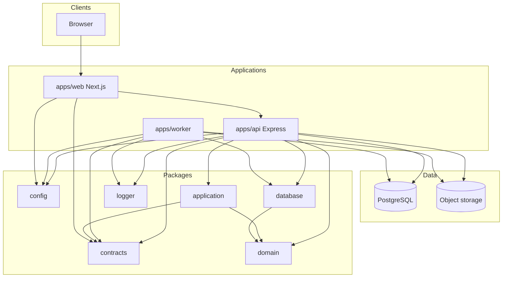

# Container architecture

Runtime containers and workspace packages. This is the C4 “container” view for a pnpm/Turborepo monorepo.

## Containers

Without the diagram:

- Browsers talk to `apps/web`.
- `apps/web` talks only to `apps/api` for business operations.
- `apps/api` and `apps/worker` share `packages/database`, `packages/contracts`, `packages/config`, and `packages/logger`.
- PDF bytes live in object storage. Rows and audit events live in PostgreSQL.

## Applications

| Container     | Responsibility                                                                                                                    | Must not                                                                                                                                    |
| ------------- | --------------------------------------------------------------------------------------------------------------------------------- | ------------------------------------------------------------------------------------------------------------------------------------------- |
| `apps/web`    | Account-user UI and signer UI. Accessibility, layout, collecting intent.                                                          | Import Prisma, call object storage, decide field coordinates of record, or treat client state as authoritative.                             |
| `apps/api`    | HTTP adapter and composition root. Authn/authz, Zod validation, idempotency, transactions for state changes, writing outbox rows. | Embed business rules in route handlers or put PDF I/O in controllers.                                                                       |
| `apps/worker` | Render/flatten signatures, produce finalized artifacts, verify PDF safety checks, mark outbox processed.                          | Perform non-idempotent side effects without a claim row; trust job payload as the document’s current state without re-reading the database. |

Each of API and worker is a composition root: construct config, logger, repositories, storage ports, and application services. Domain and application layers do not import Express, Next.js, Prisma, or cloud SDKs ([ADR-0001](adrs/0001-monorepo-and-package-boundaries.md)).

## Packages

| Package                      | Contents                                                                            |
| ---------------------------- | ----------------------------------------------------------------------------------- |
| `packages/domain`            | Entities, repository and service ports, typed errors. No frameworks or Prisma.      |
| `packages/application`       | Use cases, authorization policy, HTTP error mapping, Node clock/hash/token helpers. |
| `packages/database`          | Prisma schema, migrations, client, and tenant-scoped repository adapters.           |
| `packages/contracts`         | Zod request/response schemas shared by web, API, and worker payloads.               |
| `packages/config`            | Typed environment. The only `process.env` reader.                                   |
| `packages/object-storage`    | S3-compatible `ObjectStorage` adapter (`@aws-sdk/client-s3`); used by API/worker.   |
| `packages/observability`     | Metrics and tracing helpers shared by API and worker.                               |
| `packages/logger`            | Pino structured logging with redaction defaults.                                    |
| `packages/eslint-config`     | Shared lint, including forbidden imports for domain/application.                    |
| `packages/typescript-config` | Strict TypeScript, including `noUncheckedIndexedAccess`.                            |
| `packages/test-utils`        | Builders and fixtures.                                                              |

## Data stores

| Store          | Holds                                                                                                                                          | Does not hold                                            |
| -------------- | ---------------------------------------------------------------------------------------------------------------------------------------------- | -------------------------------------------------------- |
| PostgreSQL     | Tenants, members, documents, fields, signers, sessions (token **hashes**), consent metadata, audit chain, outbox, idempotency keys, job leases | PDF bytes, raw signing tokens, raw passwords             |
| Object storage | Revision blobs, finalized artifacts (content-addressed keys)                                                                                   | Public anonymous listing; long-lived world-readable URLs |

Local development may use Docker Compose Postgres and MinIO. Production uses managed PostgreSQL and S3-compatible or Azure Blob storage behind one storage port ([ADR-0004](adrs/0004-private-object-storage.md)).

## Typical flows

**Send document:** API authorizes the document owner, freezes fields and routing, writes `sent` plus audit and outbox in one transaction, then returns. Worker or a mail dispatcher consumes the outbox to send invitation email.

**Sign:** Signer presents a bearer token. API looks up the token hash, loads the signing session and server-owned fields, records consent and field completions, writes audit, and if the document is now complete, writes a finalization outbox row. No PDF rewrite on the request path ([ADR-0005](adrs/0005-asynchronous-finalization-worker.md)).

**Finalize:** Worker claims the outbox row, re-reads document state, uploads a content-addressed artifact, then in a short transaction marks the document `finalized` and appends audit. Object storage I/O is outside the database transaction.

## Related ADRs

[0001](adrs/0001-monorepo-and-package-boundaries.md), [0002](adrs/0002-express-api-separate-from-nextjs.md), [0003](adrs/0003-postgresql-and-prisma.md), [0004](adrs/0004-private-object-storage.md), [0005](adrs/0005-asynchronous-finalization-worker.md), [0011](adrs/0011-outbox-pattern.md).
