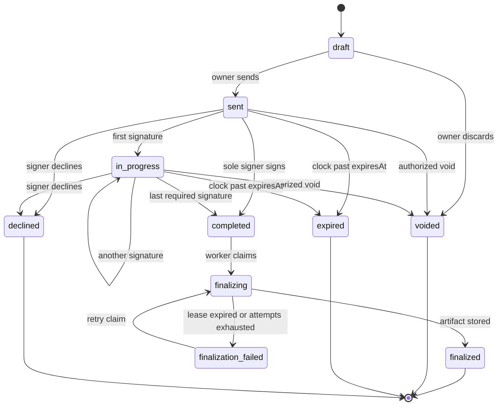

# Document lifecycle

State machine for the **Document** aggregate. The API is the only authority. The browser may suggest a next action; it must not set `state`.

## States

| State | Meaning | Signing allowed | Terminal |
| --- | --- | --- | --- |
| `draft` | Owner configures revision, fields, and signers. | No | No |
| `sent` | Frozen for signing; no signatures yet. | Yes, per routing | No |
| `in_progress` | At least one required signer has signed; others remain. | Yes, per routing | No |
| `completed` | All required signers signed; artifact not yet stored. | No | No |
| `finalizing` | A worker holds a lease to build the artifact. | No | No |
| `finalized` | Artifact digest stored; document immutable for signing. | No | Yes for signing |
| `voided` | Cancelled by an authorized tenant member. | No | Yes |
| `expired` | `expiresAt` passed before completion. | No | Yes |
| `declined` | A signer declined; remaining signers cannot complete. | No | Yes |
| `finalization_failed` | Lease released after failed attempts; waiting for retry or operator. | No | No |

`finalization_failed` is operational, not a signer-facing success state. Operators may re-queue finalization if the document is still complete and not voided.

## Permitted transitions

Without the diagram, only these transitions are legal. Anything else is a conflict error.

| From | To | Actor / trigger | Guards |
| --- | --- | --- | --- |
| `draft` | `sent` | Document owner or admin | At least one signer; all required fields assigned; current revision present; `expiresAt` in the future (UTC). Freeze fields, routing, and revision. |
| `draft` | `voided` | Owner or admin | Optional; equivalent to abandoning a draft. Still append audit. |
| `sent` | `in_progress` | Sign mutation | First successful required signature. |
| `sent` | `completed` | Sign mutation | Document had one required signer who just signed. |
| `sent` / `in_progress` | `voided` | Owner or admin | Not `completed` or later. Revoke active sessions. |
| `sent` / `in_progress` | `expired` | Expiry job or lazy check on access | `nowUtc >= expiresAt` and not completed. Revoke sessions. |
| `sent` / `in_progress` | `declined` | Assigned signer | Decline is explicit. Revoke other sessions. |
| `in_progress` | `in_progress` | Sign mutation | Additional signer completed; others remain. |
| `in_progress` | `completed` | Sign mutation | Last required signer completed. Write finalization outbox. |
| `completed` | `finalizing` | Worker | Conditional update: `state = completed` AND lease empty. Exactly one winner. |
| `finalizing` | `finalized` | Worker | Artifact uploaded; digest persisted in the same short transaction as state change. |
| `finalizing` | `finalization_failed` | Worker or lease watchdog | Attempts exceeded or lease expired without artifact. |
| `finalization_failed` | `finalizing` | Worker retry | Same claim pattern as from `completed`. |

**v1 rule:** `completed`, `finalizing`, and `finalized` cannot move to `voided`. Changing that is **legal review required** (already-captured signatures).

## Multiple signers

Each **Signer** has `routingOrder` (unsigned integer, starting at 1) and `status`: `pending`, `signed`, `declined`.

- **Ordered signing:** signers with different `routingOrder` act in ascending order. A signer may sign only when every required signer with a lower order is `signed`, and the document is `sent` or `in_progress`.
- **Parallel signing:** signers who share the same `routingOrder` may sign in any sequence, including concurrently. Completions use per-signer row updates and transactions so two parallel signers cannot corrupt routing.
- Mixed: order 1 (two parallel signers) then order 2 (one signer) is allowed.

The API ignores client-supplied “it is my turn” flags. It recomputes turn from persisted signer rows.

## Voided documents

- Allowed from `draft`, `sent`, `in_progress`.
- Effect: `state = voided`, all signing sessions `revoked`, further sign attempts return forbidden/conflict.
- Existing consent and signature payloads already stored remain as historical data; they are not erased by void. **Legal review required:** whether voiding must hide signatures from tenant UI; retention vs erasure.

## Expired signing vs expired document

- Document `expiresAt` (UTC) ends the whole workflow (`expired`).
- Signing session `expiresAt` ends that session only. If the document is still `sent` / `in_progress`, an authorized re-issue may create a new session (rate limited). **Legal review required:** re-issuance policy and notice to the signer.

Expiry is enforced on read and by a periodic worker. Do not rely on the client clock.

## Retries

- **Send:** idempotency key on the send mutation. Repeated send with the same key returns the original `sent` result; it does not re-freeze a different revision.
- **Sign:** idempotency key plus unique completion per `(documentId, signerId)` for successful sign. Duplicate submit returns the first completion.
- **Finalize:** content-addressed upload + conditional state transition. Retries after a crash must skip work if `finalized` or if the digest already exists.

## Concurrent finalization

Two workers must not both mark `finalized`.

1. Conditional `UPDATE ... WHERE id = :id AND state IN ('completed', 'finalization_failed')` set `finalizing`, `leaseOwner`, `leaseUntil`.
2. If row count is 0, exit (another worker won or state moved on).
3. Build PDF **outside** the database transaction. Upload artifact to a content-addressed key.
4. Short transaction: if still `finalizing` and lease owned by this worker, set `finalized`, store digest, append audit, complete outbox. Otherwise discard (the object key is immutable and may be orphan-GC’d later).

A unique constraint on “one finalized artifact per document” is a backstop.

## Related documents

[Signing lifecycle](signing-lifecycle.md), [Reliability model](reliability-model.md), [ADR-0005](adrs/0005-asynchronous-finalization-worker.md), [ADR-0008](adrs/0008-idempotency-strategy.md).
