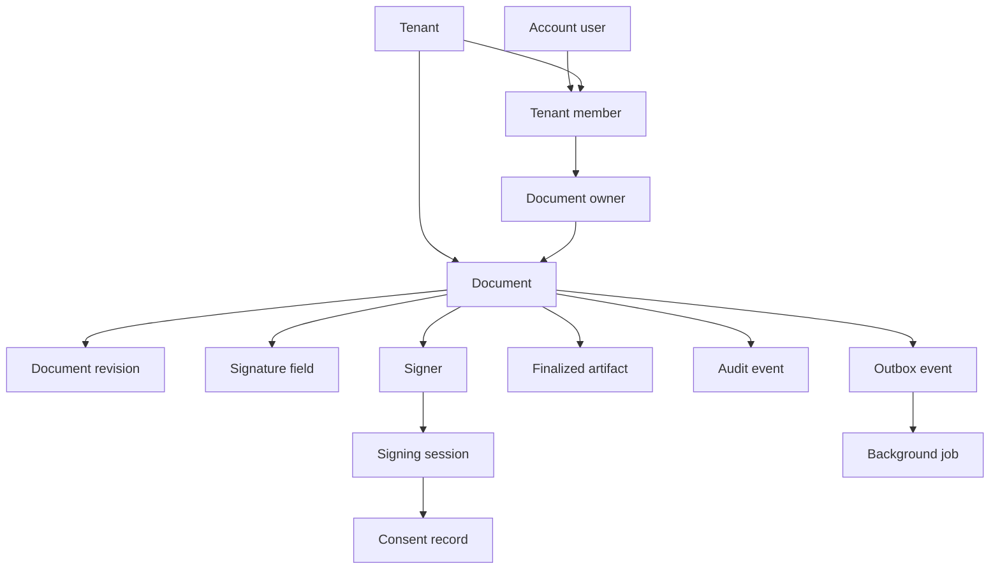

# Domain model

Canonical names for domain concepts. Use these terms in code, APIs, and docs. “Envelope” in other products maps to **Document** here.

None of this is a legal definition of “signer,” “consent,” or “signature.” **Legal review required** before customer-facing use of those words.

## Entity map

Without the diagram: a tenant has members (account users with roles) and documents. A document has an owner, revisions, server-owned fields, signers, audit events, and at most one finalized artifact. A signer has signing sessions; a session may have a consent record. Outbox events create background jobs.

## Distinctions that must not be collapsed

### Account user

A person who can authenticate to the SaaS (password, later SSO). Has an opaque `accountUserId`. Exists independently of any tenant. Not automatically allowed to see documents.

### Organization / tenant member

A membership row: this account user belongs to this tenant with a role (for v1: `owner`, `admin`, `member`). Authorization for tenant resources is based on membership plus role, never on “logged in.” An account user may belong to multiple tenants; the active tenant is chosen server-side from membership, not from a client-supplied tenant header.

### Document owner

The tenant member who created the document (or an admin who took ownership through an explicit, audited transfer). Ownership is a relation on the document, not “whoever knows the ID.” Owners (and tenant admins, per policy) may draft, send, void, and download. Owners are not signers unless also added as a **Signer**.

### Signer

A party who must act on the document. Identified by opaque `signerId` scoped to the document. Has routing order, optional email, display name, and completion state. A signer may or may not be an account user. Knowing an email address does not grant tenant membership.

### Signing session

A time-bounded, revocable capability for one signer to act on one document. Created when a signing link is issued (or re-issued). Stores only a **hash** of the bearer token, expiry in UTC, and status. Multiple sessions may exist over time; only one should be `active` per signer unless the previous is expired or revoked.

### Signature field

A server-owned instruction: page, normalized coordinates, type (`signature`, `initials`, `date_signed`), and assigned `signerId`. The browser may display fields but must not invent, move, or reassign them. Placement changes in `draft` only, by authorized tenant members, persisted by the API.

### Document revision

An immutable snapshot of uploaded (or system-generated intermediate) PDF bytes. Identified by opaque `revisionId` plus a content digest. The document points at a `currentRevisionId` while in `draft`. After `sent`, the revision used for signing is frozen.

### Finalized artifact

The immutable output PDF after all required signatures are applied. At most one successful artifact per document. Stored with a content-addressed object key and a digest recorded on the document. Not a revision of the source file; it is a distinct object.

### Audit event

An append-only, hash-chained record of a security-relevant action. Never updated or deleted in application code. See [audit model](audit-model.md).

### Consent record

Evidence that, during a signing session, the signer was shown specific consent copy (versioned identifier, not necessarily full text duplication) and performed an affirmative action. Includes UTC timestamp and session id. Client IP and user agent may be stored as **untrusted metadata**. **Legal review required:** whether this record is sufficient for any jurisdiction or use case; wording of consent copy; whether checkboxes, click-wrap, or browse-wrap are used.

### Background job

A unit of work executed by `apps/worker` (PDF checks, mail send, finalization). Identified by opaque id, type, attempt count, lease, and status. Must be idempotent.

### Outbox event

A row written in the **same database transaction** as a state transition, later polled and turned into a background job. Guarantees “state changed ⇒ work will be attempted.” See [ADR-0011](adrs/0011-outbox-pattern.md).

## Document aggregate (invariants)

- Every document has exactly one `tenantId` and one document owner membership.
- Signers, fields, sessions, consent, revisions, artifacts, and audit events for that document share that `tenantId`.
- Required fields for a signer must be completed before that signer is `signed`.
- A document reaches `completed` only when every required signer is `signed` (or policy-defined waivers, which v1 does not have).
- `finalized` requires a stored artifact digest that matches bytes in object storage.

## Identifiers

All public IDs are opaque (UUIDv7 or equivalent). Do not expose sequential integers. Do not use email as a primary key.

## Related documents

[Document lifecycle](document-lifecycle.md), [Signing lifecycle](signing-lifecycle.md), [ADR-0007](adrs/0007-server-owned-signature-placement.md), [ADR-0013](adrs/0013-multi-tenancy-isolation.md).
