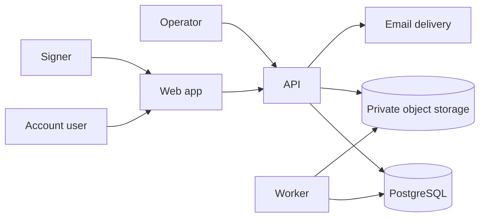

# System context

How the product sits among people and external systems. Diagrams are optional; the tables are authoritative if Mermaid does not render.

## Context diagram

Without the diagram: account users and signers use the web app. The web app calls the API. The API reads and writes PostgreSQL and private object storage, and requests email delivery. The worker reads PostgreSQL and object storage to process PDFs. Operators use authenticated internal procedures, not signer links.

## People

| Person | Goal | Trust |
| --- | --- | --- |
| Account user | Manage tenant documents | Authenticated to the SaaS; still untrusted for authorization (must be a member of the tenant). |
| Signer | Review and sign a specific document | Authenticated only to a signing session; not a tenant member unless separately invited. |
| Operator | Restore service, verify audit chains | Highly privileged; insider threat in [threat model](../security/threat-model.md). |
| Attacker | Steal documents, forge signatures, disrupt service | Untrusted. Every upload, URL, header, and PDF is attacker-controlled until proven otherwise. |

## Software systems

| System | Role | Notes |
| --- | --- | --- |
| Web (`apps/web`) | Presentation | Next.js. No Prisma. No object-storage SDKs. |
| API (`apps/api`) | HTTP boundary | Express. Validates input, authorizes, runs application services. |
| Worker (`apps/worker`) | Async PDF and finalization | Consumes outbox-backed jobs. Retries must be idempotent. |
| PostgreSQL | Metadata, sessions, audit, outbox | No PDF bytes. |
| Object storage | Document revisions and finalized artifacts | S3-compatible or Azure Blob; MinIO locally. Private buckets only. |
| Email delivery | Signing invitations and notifications | Contents are sensitive; do not put raw signing tokens in logs. Provider is a subprocessor. **Legal review required** for notification content and international transfer. |

Identity providers, SMS, and customer SSO are not in v1 context. If added later, they become additional trust boundaries (see [ADR-0009](adrs/0009-authentication-boundaries.md)).

## Trust boundaries

1. **Browser → web/API:** TLS. CSRF protections on cookie-authenticated account-user routes. Signer routes use bearer tokens, not account cookies.
2. **API → PostgreSQL:** private network, least-privilege DB roles. Application enforces tenant isolation; the database also carries `tenant_id` on tenant-scoped rows.
3. **API/worker → object storage:** private containers, no public ACLs, server-side encryption at rest as offered by the provider (this is not application-layer customer-managed encryption).
4. **API → email:** the message may contain a signing URL. Treat that URL as a secret in logs.
5. **Worker → PDF libraries:** parse untrusted PDFs in the worker, never in the browser as the authorization source, and never with implicit network fetches from the document (SSRF).

## What this system does not trust

- Document IDs, signer IDs, field IDs, coordinates, or status sent by the browser.
- `X-Forwarded-For`, `X-Tenant-Id`, or similar headers as identity.
- Email as proof of personhood.
- Object-storage URLs that are not generated by the platform for the current principal.

## Related documents

- [Container architecture](container-architecture.md)
- [Threat model](../security/threat-model.md)
- [ADR-0002](adrs/0002-express-api-separate-from-nextjs.md)
